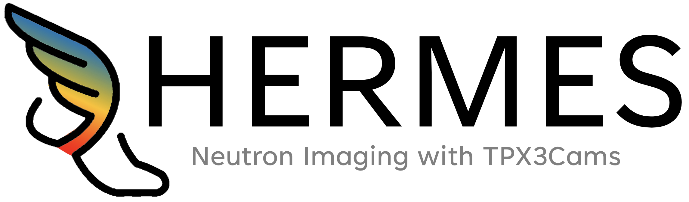

# HERMES: High-speed Event Retrieval and Management for Enhanced Spectral neutron imaging with TPX3Cams #

## What is HERMES? ##
HERMES comprises a set of Python and C/C++ libraries (not a standalone program) designed to support the development of custom code for acquiring, processing, and analyzing data from the TPX3Cam manufactured by [Amsterdam Scientific Instruments](https://www.amscins.com/buy-here/tpx3cam/ "ASI TPX3Cam"). HERMES' primary function is provide the foundational tools needed for users to create applications tailored to their specific requirements in energy-resolved neutron imaging with TPX3Cams, along with it's subsequent analysis. With HERMES users have access to a flexible framework that simplifies the integration of TPX3Cam's capabilities into their projects, while also providing the needed diagnostics for development and trouble shooting. 

## Quick Start ##

HERMES is currently only supported on Linux/MacOS systems. For Windows installation, use a Linux environment such as WSL. You can install WSL by following the instructions on the [Microsoft WSL documentation](https://learn.microsoft.com/en-us/windows/wsl/).

To begin, install pixi and HERMES into desired directory using: 
   ```
   curl -fsSL https://pixi.sh/install.sh | sh
   git clone https://github.com/lanl/HERMES.git
   ```
Now, ```cd``` into your HERMES directory that was just created. You should see:
   ```bash
   user@hostname:~/HERMES
   ```

If so, run the following in the HERMES directory.
   ```
   pixi install
   pixi shell
   pixi run build-cpp
   ```
Pixi will automatically install required dependencies and manage the python version for HERMES. If everything worked correctly, you should see the text (hermes) in your terminal preceding the current address.
   ```bash 
   (hermes) user@hostname:~/HERMES
   ```

From here, HERMES has successfully been installed. To get started, run the following code in your base HERMES directory (/HERMES)
```
cp examples/notebooks/analysis_hermes.ipynb workspace/
```
This provides a basic starting point for HERMES users. For more detailed instruction and function of HERMES, refer to the user manual. 


## License ## 
HERMES is distributed as open-source software under an MIT License, with LANL open source approval (reference O4660). Please see LICENSE for more details. 